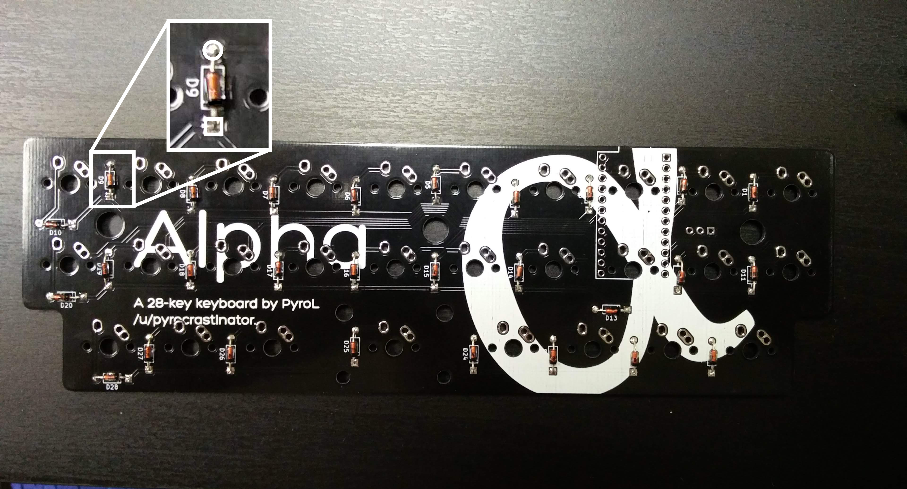
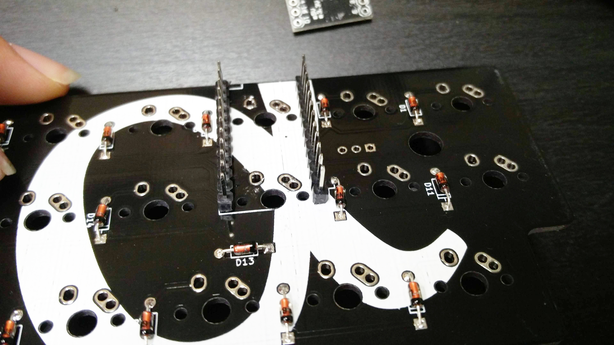
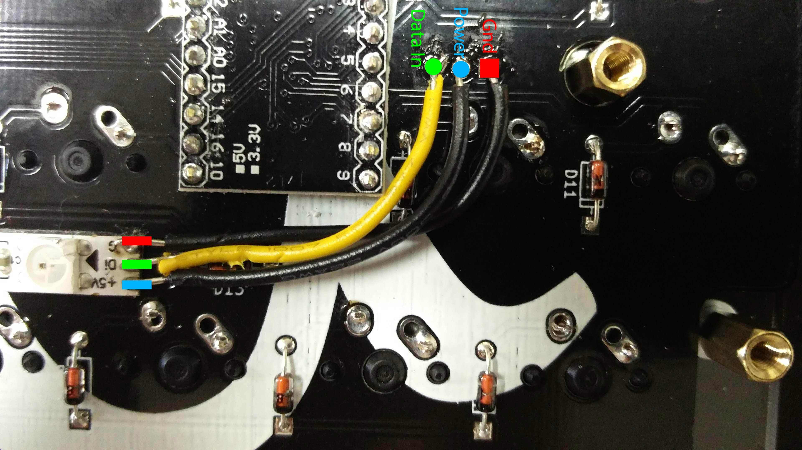

# Alpha 

A 28-key semi-ortholinear mechanical keyboard designed by PyroL 

# Build instructions

## Parts

- [ ] 1x Alpha PCB
- [ ] 28x 1N4148 or equivalent diodes
- [ ] 1x Pro Micro
- [ ] 1x Case or plate set
- [ ] 5x 10mm M3 standoffs
- [ ] 10x 5mm M3 screws
- [ ] 28x MX or Alps style switches of your choice
- [ ] 1x Micro USB cable

## Tools

- [ ] Soldering station
- [ ] Wire cutter
- [ ] Screwdriver

## Before you start

Orient the PCB correctly before you start the build: the blockers on the side closer to you, and the Pro Micro holes on the left. You should be able to read the "Too. Many. Keys." slogan on the side facing up.

 

(OPTIONAL): Install a 2u stabilizer.

## Step 1: Diodes

Install and solder the diodes on the bottom of the PCB, with the black line facing the square pad. Cut the excess leads. 

## Step 2: Pro Micro
Insert the short side of the Pro Micro standoffs into the bottom of the PCB, and solder them in from the top.

Mount the two switches that will sit in between the Pro Micro standoffs in the plate and solder them into the PCB at that location. Clip the pins after soldering to ensure the Pro Micro will sit flat. 

Mount the Pro Micro on the bottom of the PCB, smooth side facing you. Solder.

**Very important:** after soldering, use a wire cutter to clip as much of the protruding standoff as possible. With 10mm standoffs this is a snug fit, and it is impossible with the standoffs at full length. Reflow your solder if it climbed up the wire.

## Step 3: Switches

Mount the switches in the plate, and solder them all in.

## Step 4 (OPTIONAL): LED strip

Remove the 3M adhesive strip on the back of your LED strip and place it on the bottom of the PCB. Cut 3 wires of similar length, preferably of different colors. The LEDs connect to the three-pin header next to the Pro Micro holes. Connect GND to the hole with a square pad, power to the middle hole, and Data In to the last hole.

## Step 5: Case and firmware

Assemble the case: for each hole, pass a screw through the top plate, screw in a standoff to finger tightness, then screw in through the bottom plate. Once all screws and standoffs are installed, use a screwdriver to tighten as needed (but not too tight, as acrylic can be brittle!). Flash using QMK (use my firmware, or kbfirmware.com), and enjoy!

# To add:

- screenshots of default keymaps
