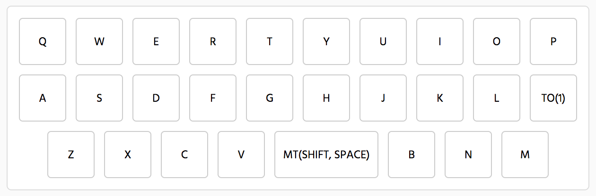
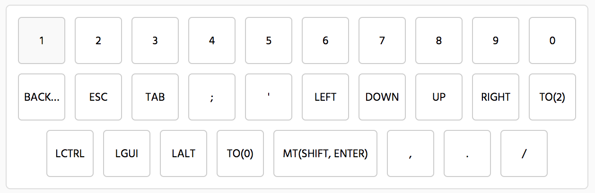
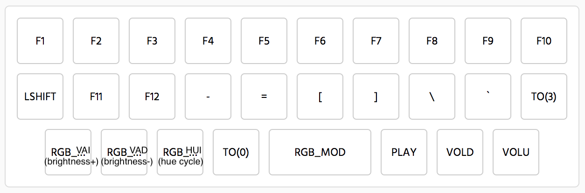

# A guide to the keymap

In this document I will go through the basic functionality of the Alpha's default keymap. Several functions are kept consistent throughout all the layers. 

 - last key on the 2nd row toggles the next layer. This is not a hold function, just one tap switches.

 - The key to the left of the spacebar returns to the home layer.

The default keymap is somewhat organized by function:

 - Home layer: All letters, spacebar is shift on hold.

 

 - Mod layer 1: numbers on top row, vim keys, essential punctuation, and essential mods (Ctrl, OS, Alt, Backspace, Tab, Esc). Enter is on spacebar tap, but shift works the same way. 
 
 

 - Mod layer 2: function keys, RGB control, basic media controls, and math. 
 

The final layer has a soft reset button on Q, and spacebar is macro with a special little message from me :)
